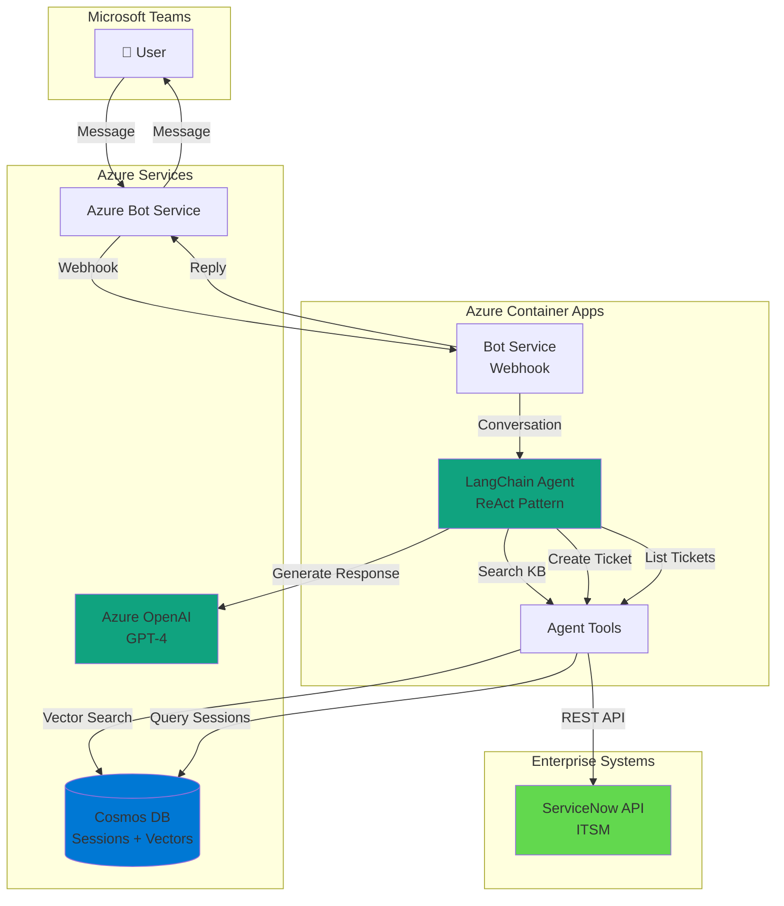

# Enterprise IT Chatbot 🤖💼

[](https://opensource.org/licenses/MIT)
[](https://www.python.org/downloads/)
[](https://azure.microsoft.com/)
[](https://www.langchain.com/)

> **Intelligent agentic AI chatbot for enterprise IT support via Microsoft Teams**

Production-ready IT support bot leveraging LangChain agents, Azure OpenAI, and enterprise system integrations (Teams, ServiceNow, Cosmos DB). Features multilingual support, autonomous ticket management, and knowledge base search.

---

## 🎯 What It Does

An enterprise-grade conversational AI assistant that:
- 🤖 **Autonomous Agent**: Uses LangChain ReAct agents for multi-step reasoning
- 💬 **Microsoft Teams Integration**: Native bot framework integration
- 🎫 **Ticket Management**: Creates/lists ServiceNow incidents automatically
- 📚 **Knowledge Base Search**: Vector search in Cosmos DB for documentation
- 🌍 **Multilingual**: Auto-detects user language and responds accordingly
- 🔄 **Session Management**: Persistent conversation context across interactions

---

## 🏗️ Architecture



---

## ✨ Key Features

### 🧠 **Agentic AI Architecture**
- **LangChain ReAct Agent**: Multi-step reasoning with tool selection
- **Dynamic Tool Execution**: Autonomously decides which tools to use
- **Context Awareness**: Maintains conversation history across turns
- **Error Recovery**: Graceful fallback when tools fail

### 🔧 **Agent Tools**
1. **Knowledge Base Search** - Vector search against documentation
2. **Create ServiceNow Ticket** - Autonomous incident/request creation
3. **List User Tickets** - Retrieve ticket history from ServiceNow
4. **Session Management** - Persist conversation state in Cosmos DB

### 🏢 **Enterprise Integrations**
- **Microsoft Teams**: Native Bot Framework v4 SDK
- **ServiceNow**: REST API with OAuth/Basic Auth support
- **Azure Cosmos DB**: NoSQL for sessions + Vector search for KB
- **Azure OpenAI**: GPT-4 for generation, text-embedding for retrieval

### 🛡️ **Production-Ready**
- **Containerized Deployment**: Docker + Azure Container Apps
- **Structured Logging**: JSON logs with `structlog` for observability
- **Resilience Patterns**: Retry logic with exponential backoff
- **Environment-Based Config**: 12-factor app principles
- **CI/CD Pipeline**: Azure DevOps with automated builds

---

## 🚀 Quick Start

### Prerequisites

- Python 3.11+
- Docker (for containerization)
- Azure subscription with:
  - Azure Bot Service
  - Azure OpenAI Service
  - Azure Cosmos DB
  - Azure Container Apps (for deployment)
- ServiceNow instance with API access

### Local Development

1. **Clone the repository**
```bash
git clone https://github.com/larusso94/enterprise-it-chatbot.git
cd enterprise-it-chatbot
```

2. **Create virtual environment**
```bash
python -m venv .venv
source .venv/bin/activate  # Linux/Mac
# .venv\Scripts\activate    # Windows
```

3. **Install dependencies**
```bash
pip install -r requirements.txt
```

4. **Configure environment**

Create `.env` file:
```env
# Azure OpenAI
OPENAI_API_BASE=https://YOUR-RESOURCE.openai.azure.com/
OPENAI_API_KEY=your-api-key
OPENAI_DEPLOYMENT_NAME=gpt-4-deployment
OPENAI_EMBED_DEPLOYMENT=text-embedding-ada-002
OPENAI_API_VERSION=2024-02-15-preview

# Azure Cosmos DB
COSMOS_ENDPOINT=https://YOUR-ACCOUNT.documents.azure.com:443/
COSMOS_KEY=your-cosmos-key
COSMOS_DATABASE=itchatbot
COSMOS_CONTAINER_SESSIONS=sessions
COSMOS_CONTAINER_VECTORS=vstore

# ServiceNow
SERVICENOW_INSTANCE_URL=https://your-instance.service-now.com
SERVICENOW_USERNAME=your-username
SERVICENOW_PASSWORD=your-password
# OR use OAuth
SERVICENOW_OAUTH_CLIENT_ID=your-client-id
SERVICENOW_OAUTH_CLIENT_SECRET=your-client-secret

# Microsoft Bot Framework
MICROSOFT_APP_ID=your-bot-app-id
MICROSOFT_APP_PASSWORD=your-bot-password
MICROSOFT_APP_TYPE=SingleTenant
MICROSOFT_TENANT_ID=your-tenant-id

# Application
LOG_LEVEL=INFO
PORT=8000
```

5. **Run the bot**
```bash
python mcp/app.py
```

The bot will start on `http://localhost:8000`

### Testing with Bot Framework Emulator

1. Download [Bot Framework Emulator](https://github.com/Microsoft/BotFramework-Emulator/releases)
2. Open Emulator and connect to: `http://localhost:8000/api/messages`
3. Enter your `MICROSOFT_APP_ID` and `MICROSOFT_APP_PASSWORD`
4. Start chatting!

---

## 📁 Project Structure

```
enterprise-it-chatbot/
├── mcp/                        # Main application
│   ├── app.py                 # aiohttp server + Bot webhook
│   ├── agent.py               # LangChain agent orchestration
│   ├── agent_tools.py         # Tool definitions (KB, tickets)
│   └── config.py              # Environment configuration
├── clients/                    # External integrations
│   ├── echo_bot.py            # Bot Framework message handler
│   ├── cosmos_client.py       # Cosmos DB operations
│   ├── servicenow_client.py   # ServiceNow API client
│   ├── logging_client.py      # Structured logging
│   └── resilience_utils.py    # Retry/circuit breaker
├── Dockerfile                  # Multi-stage container build
├── requirements.txt            # Python dependencies
├── .dockerignore              # Docker build exclusions
└── README.md                  # This file
```

---

## 🔧 Configuration

### Agent Behavior

Configure in `.env`:

```env
# Agent parameters
AGENT_MAX_CONTEXT_TURNS=6        # Conversation history length
AGENT_MAX_TOKENS=2000            # Max tokens per response
VECTOR_SEARCH_TOP_K=3            # KB search results

# Logging
LOG_LEVEL=INFO                   # DEBUG, INFO, WARNING, ERROR
LOG_JSON=1                       # Enable JSON logging
```

### ServiceNow Authentication

Supports multiple auth methods:

**Option 1: Basic Auth**
```env
SERVICENOW_USERNAME=admin
SERVICENOW_PASSWORD=password
```

**Option 2: Bearer Token**
```env
SERVICENOW_TOKEN=your-bearer-token
```

**Option 3: OAuth 2.0**
```env
SERVICENOW_OAUTH_CLIENT_ID=your-client-id
SERVICENOW_OAUTH_CLIENT_SECRET=your-client-secret
```

---

## 🐋 Docker Deployment

### Build Image

```bash
docker build -t enterprise-it-chatbot:latest .
```

### Run Container

```bash
docker run -d \
  --name it-chatbot \
  -p 8000:8000 \
  --env-file .env \
  enterprise-it-chatbot:latest
```

### Push to Azure Container Registry

```bash
# Tag for ACR
docker tag enterprise-it-chatbot:latest yourregistry.azurecr.io/it-chatbot:latest

# Login to ACR
az acr login --name yourregistry

# Push
docker push yourregistry.azurecr.io/it-chatbot:latest
```

---

## ☁️ Azure Container Apps Deployment

### Using Azure CLI

```bash
# Create Container App
az containerapp create \
  --name it-chatbot \
  --resource-group your-rg \
  --environment your-container-env \
  --image yourregistry.azurecr.io/it-chatbot:latest \
  --target-port 8000 \
  --ingress external \
  --min-replicas 1 \
  --max-replicas 5 \
  --env-vars \
    OPENAI_API_BASE=secretref:openai-endpoint \
    OPENAI_API_KEY=secretref:openai-key \
    COSMOS_ENDPOINT=secretref:cosmos-endpoint \
    COSMOS_KEY=secretref:cosmos-key \
    MICROSOFT_APP_ID=secretref:bot-app-id \
    MICROSOFT_APP_PASSWORD=secretref:bot-password
```

### Configure Bot Service Webhook

After deployment, update your Azure Bot Service messaging endpoint:
```
https://your-app.region.azurecontainerapps.io/api/messages
```

---

## 🧪 Usage Examples

### Example 1: Knowledge Base Search

```
User: What is the password policy?
Bot: [Agent searches KB → Retrieves policy → Generates answer]
     "The password policy requires: 
      - Minimum 12 characters
      - At least 1 uppercase, 1 number, 1 special char
      - Change every 90 days..."
```

### Example 2: Create Incident

```
User: I can't access my email
Bot: [Agent decides to create ticket]
     "I've created incident INC0010234 for your email access issue.
      Priority: Medium
      Assigned to: IT Support Team
      You'll receive updates via email."
```

### Example 3: Check Ticket Status

```
User: What's the status of my tickets?
Bot: [Agent queries ServiceNow]
     "You have 2 open tickets:
      1. INC0010234 - Email Access (In Progress)
      2. REQ0005678 - Software Request (Pending Approval)"
```

---

## 🏢 Architecture Decisions

### Why LangChain Agents?

| Feature | Benefit |
|---------|---------|
| **ReAct Pattern** | Combines reasoning + action for complex multi-step tasks |
| **Tool Abstraction** | Easy to add new integrations (Jira, Slack, etc.) |
| **Memory Management** | Built-in conversation buffer |
| **Error Handling** | Graceful degradation when tools fail |

### Why Azure Container Apps?

- **Serverless scaling**: Pay only for usage
- **KEDA integration**: Auto-scale based on HTTP requests
- **Managed identity**: No credential management
- **Native Azure integration**: Cosmos DB, Key Vault, App Insights

### Design Patterns

- **Agent Pattern**: Autonomous decision-making with LangChain
- **Circuit Breaker**: Resilience for ServiceNow API calls
- **Repository Pattern**: Cosmos DB abstraction
- **Dependency Injection**: Config-driven service initialization

---

## 📊 Performance

- **Response Time**: 2-4s (depends on tool execution)
- **Agent Reasoning**: ~500ms (GPT-4 decision)
- **Vector Search**: <100ms (Cosmos DB)
- **ServiceNow API**: ~300ms (ticket creation)
- **Throughput**: 50+ concurrent users (with auto-scaling)

---

## 🛠️ Development

### Adding New Tools

Create a new tool in `mcp/agent_tools.py`:

```python
@tool
def my_custom_tool(query: str) -> str:
    """Tool description for the agent."""
    # Your implementation
    return result

# Register in agent.py
tools = [knowledge_base_search, create_ticket, my_custom_tool]
```

### Testing

```bash
# Unit tests
pytest tests/

# Integration tests
pytest tests/integration/

# Coverage
pytest --cov=mcp --cov-report=html
```

---

## 🚧 Roadmap

- [ ] Add Jira integration as alternative to ServiceNow
- [ ] Implement approval workflows for ticket creation
- [ ] Add Slack adapter for multi-channel support
- [ ] Metrics dashboard (Grafana + Prometheus)
- [ ] A/B testing framework for agent prompts
- [ ] Fine-tune embedding model on company docs
- [ ] Implement RBAC for tool access

---

## 🤝 Contributing

Contributions welcome! Please:
1. Fork the repository
2. Create a feature branch
3. Add tests for new features
4. Ensure code passes `black` + `mypy`
5. Submit a Pull Request

---

## 📄 License

This project is licensed under the MIT License - see [LICENSE](LICENSE) file.

---

## 🙏 Acknowledgments

- **LangChain** for agent framework
- **Microsoft** for Bot Framework and Azure services
- **ServiceNow** for ITSM API

---

## 📧 Contact

**Lautaro Russo**
- LinkedIn: [linkedin.com/in/lautaro-russo](https://www.linkedin.com/in/lautaro-russo/)
- Email: lrussobertolez@gmail.com
- Portfolio: [github.com/larusso94/larusso94](https://github.com/larusso94/larusso94)

---

<div align="center">

**Built for Enterprise IT Operations** 🏢🤖

[⭐ Star this repo](https://github.com/larusso94/enterprise-it-chatbot) | [🐛 Report Bug](https://github.com/larusso94/enterprise-it-chatbot/issues) | [💡 Request Feature](https://github.com/larusso94/enterprise-it-chatbot/issues)

</div>
